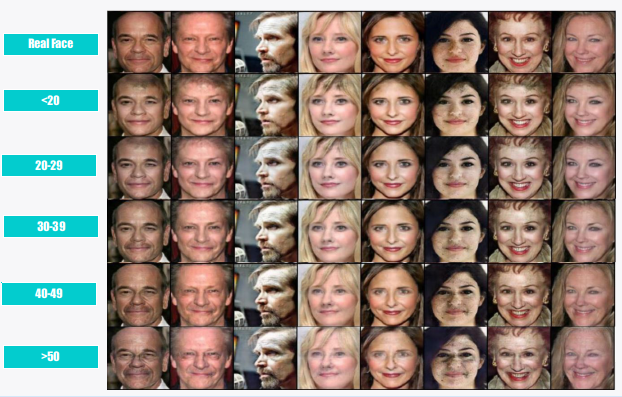

# Face Aging with Conditional GANs

## Usage

### Data Preparation

1. Download the [cacd-2000](https://bcsiriuschen.github.io/CARC/) datasets and unzip.
2. Use preprocess/preprocess_cacd.py to crop and align face region.
3. Use preprocess/gentraingroup.py to generate training list, please refer to data/cacd2000-lists as an example.

### Training

1. Pretrain Age Classify model

``` python
python pretrain_alexnet.py
```

2. Train IPCGANs

``` python
python IPCGANS_train.py
```

3. Pretrained IPCGANs and AgeAlexnet model can be downloaded [here](https://pan.baidu.com/s/1a6YkVMmT1HcGvgX0YLO9kQ), password:Lr6a

### Visualize



### Server

This project acted as an server for Android [demo](https://github.com/guyuchao/IPCGANs-Android). You can start flask server.
``` python
python app.py 
```

### Dependencies

This code depends on the following libraries:

* Python 3.6
* Pytorch 0.4.1
* PIL
* TensorboardX
* Flask

# Authors
## Kaushik Jadhav
<ul>
<li>Github:https://github.com/kaushikjadhav01</li>
<li>Medium:https://medium.com/@kaushikjadhav01</li>
<li>LinkedIn:https://www.linkedin.com/in/kaushikjadhav01/</li>
</ul>


